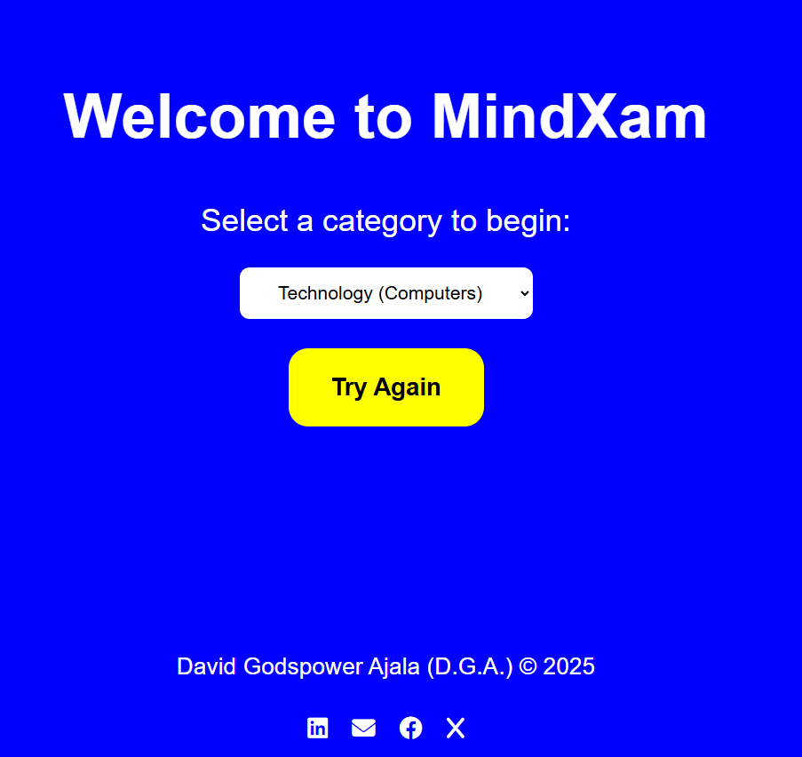

# 🧠 MindXam - Dynamic Quiz Application

MindXam is an interactive, web-based quiz application that challenges users with random trivia questions. Built with vanilla JavaScript, it connects to the **Open Trivia Database API** to ensure you never run out of new questions.

**[🚀 View Live Demo](https://david-godspower.github.io/MindXam/)**

## ✨ Features

- **Dynamic Questions:** Fetches real-time data from the Open Trivia API (no hardcoded questions).
- **Category Selection:** Choose from topics like Technology, Current Affairs, Sports, History, and more.
- **Timer System:** A 60-second countdown keeps the pressure on!
- **Progress Tracking:** Visual progress bar shows how far you are in the quiz.
- **Review System:** At the end of the quiz, see exactly which questions you got right or wrong with the correct answers highlighted.
- **Responsive Design:** Works seamlessly on mobile, tablet, and desktop.
- **Loading States:** Custom spinners and error handling for smooth user experience.

## 🛠️ Technologies Used

- **HTML5:** Structure and semantic markup.
- **CSS3:** Custom styling, Flexbox layout, and responsive media queries.
- **JavaScript (ES6+):** Async/Await for API fetching, DOM manipulation, and game logic.
- **Open Trivia DB API:** The external service used for question data.

## 🚀 How to Run Locally

To run this project on your local machine, follow these steps:

1.  **Clone the repository:**
    ```bash
    git clone https://github.com/David-Godspower/MindXam.git
    ```
2.  **Navigate to the project folder:**
    ```bash
    cd MindXam
    ```
3.  **Open the file:**
    Simply double-click `index.html` to open it in your browser.
    _Note: For the best experience, use "Live Server" in VS Code to avoid any local CORS issues, though the current API setup supports direct file opening._

## 📸 Screenshots

|        Start Screen         |        Quiz Interface        |        Results & Review         |
| :-------------------------: | :--------------------------: | :-----------------------------: |
|  |  |  |

## 🧩 How It Works

1.  **Selection:** The user selects a category from the dropdown menu.
2.  **Fetching:** The app sends an HTTPS request to `opentdb.com` with the specific category ID.
3.  **Processing:** The API returns JSON data. The app decodes HTML entities (like `&quot;`) and shuffles the correct answer into the list of incorrect options so the answer position is random.
4.  **Gameplay:** The user answers 10 questions. The timer runs continuously.
5.  **Results:** A score is calculated, and a detailed review list is generated dynamically.

## 👤 Author

**David Godspower Ajala**

- Portfolio: [David Godspower Ajala](https://david-godspower.github.io/david-portfolio/)
- LinkedIn: [David Godspower Ajala](https://www.linkedin.com/in/david-godspower-ajala/)
- Twitter/X: [David Ajala](https://x.com/ajala28981)
- Email: [ajaladavid11@gmail.com](mailto:ajaladavid11@gmail.com)

## 📄 License

This project is open source and available under the [MIT License](LICENSE).
