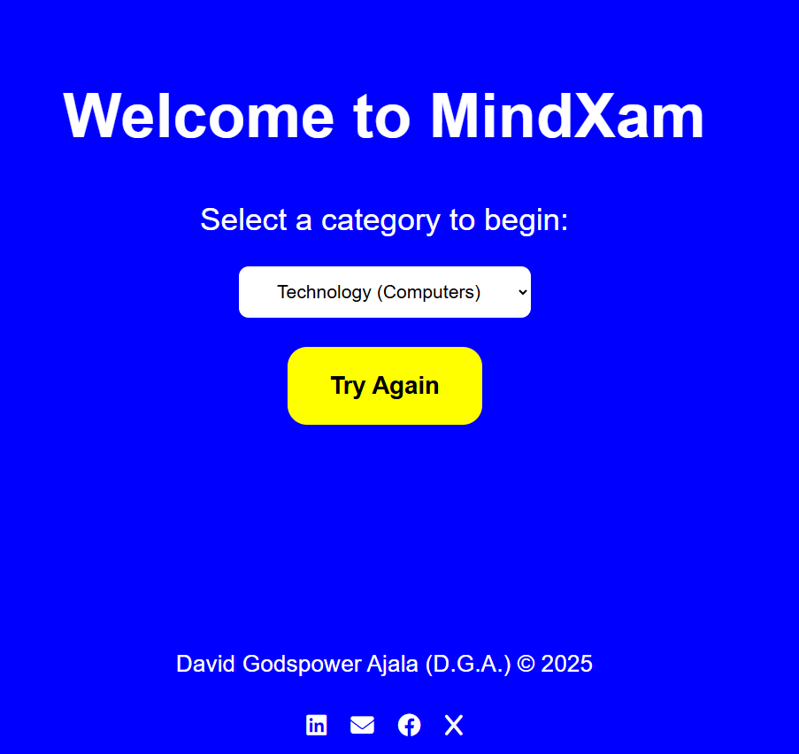

# 🧠 MindXam

MindXam is a polished, browser-based trivia game built with vanilla HTML, CSS, and JavaScript. Choose a category, answer 15 dynamically generated multiple-choice questions, and see your score at the end of a timed attempt.

**[🚀 Play the live demo](https://david-godspower.github.io/MindXam/)**

## ✨ Features

- **Dynamic trivia:** Questions are loaded from the [Open Trivia Database API](https://opentdb.com/).
- **Category selection:** Choose from general knowledge, technology, mathematics, sports, history, animals, literature, films, vehicles, and more.
- **Timed gameplay:** Complete each quiz within a two-minute countdown.
- **Progress tracking:** A progress bar shows your position throughout the quiz.
- **Flexible navigation:** Select an answer, skip a question, or move back to a previous question.
- **Automatic scoring:** Receive a percentage score and a grade from A to F when the quiz ends.
- **Responsive interface:** The glassmorphism layout adapts to desktop, tablet, and mobile screens.
- **Helpful states:** Loading and retry states provide feedback while questions are being fetched.

## 🛠️ Built with

- **HTML5** for the page structure and semantic markup
- **CSS3** for responsive styling, layout, animations, and the glassmorphism design
- **JavaScript (ES6+)** for API requests, quiz state, timers, navigation, scoring, and DOM updates
- **Open Trivia Database API** for question data
- **Font Awesome** for interface icons
- **Canvas Confetti** for the high-score celebration

## 🚀 Getting started

### Prerequisites

You only need a modern web browser. No build tools, package manager, or server-side runtime is required.

### Run locally

1. **Clone the repository**

   ```bash
   git clone https://github.com/David-Godspower/MindXam.git
   ```

2. **Open the project directory**

   ```bash
   cd MindXam
   ```

3. **Start the app**

   Open `index.html` directly in your browser, or use an extension such as **Live Server** in VS Code for a local development server.

   > A local server is recommended because it provides a more consistent development environment when making browser requests to external APIs.

## 🎮 How to play

1. Select a quiz category from the start screen.
2. Click **Initialize Quiz** to load 15 questions.
3. Choose an answer to advance, or use **Skip** to move on.
4. Use **Previous** to revisit an earlier question during the attempt.
5. Finish before the timer reaches zero to view your percentage score and grade.
6. Select **New Attempt** to start over with a fresh quiz.

## 📁 Project structure

```text
MindXam/
├── index.html          # Application markup and quiz screens
├── style.css           # Layout, theme, and responsive styles
├── script.js           # API integration and quiz logic
├── startscreen.png     # Start-screen preview
├── quizinterface.png   # Quiz-screen preview
├── result-review.png   # Results-screen preview
├── LICENSE             # MIT license
└── README.md           # Project documentation
```

## 📸 Screenshots

| Start screen | Quiz interface | Results screen |
|:---:|:---:|:---:|
|  |  |  |

## 🔌 API notes

MindXam requests multiple-choice questions from Open Trivia DB at runtime. Because the app depends on a third-party API:

- An internet connection is required to start a quiz.
- API availability and response limits may affect question loading.
- Questions are decoded before being displayed so entities such as `&quot;` render correctly.
- No user accounts or personal data are collected.

## 👤 Author

**David Godspower Ajala**

- [Portfolio](https://davidgodspowerajala.me)
- [LinkedIn](https://www.linkedin.com/in/david-godspower-ajala/)
- [Twitter/X](https://x.com/DavidGAjala)
- [Email](mailto:ajaladavid11@gmail.com)

## 📄 License

This project is open source and available under the [MIT License](LICENSE).
